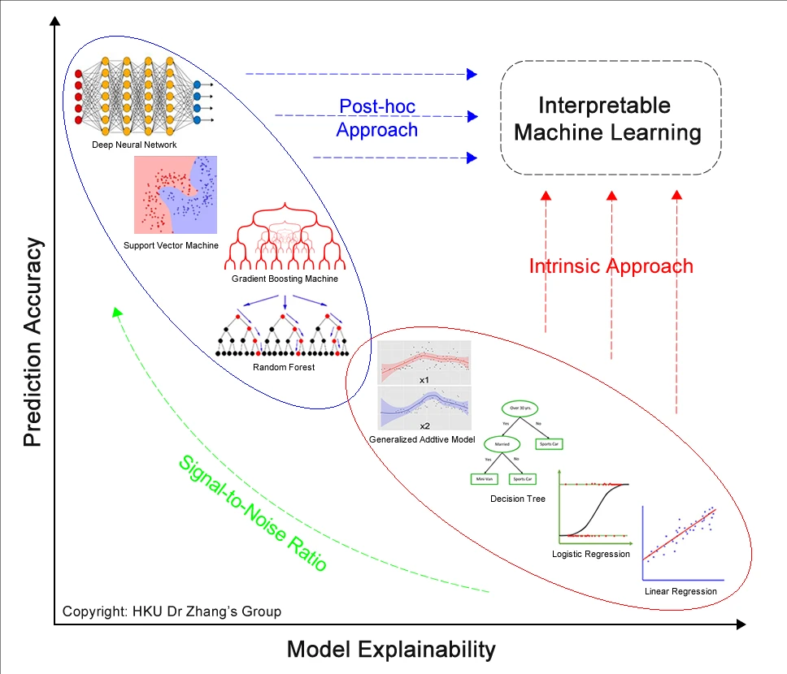
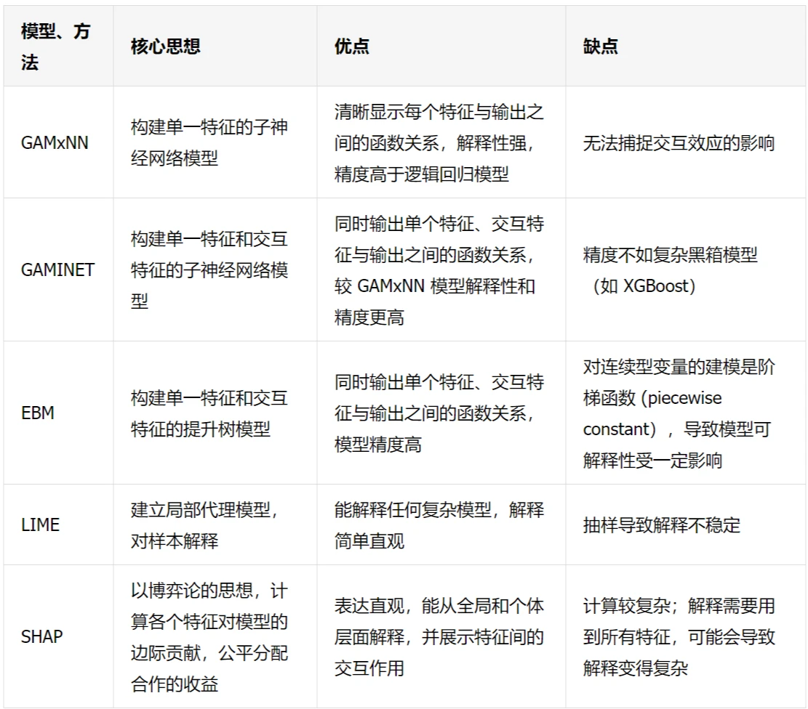
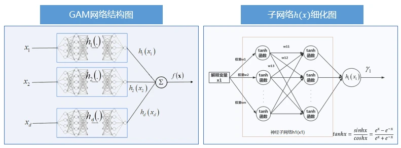
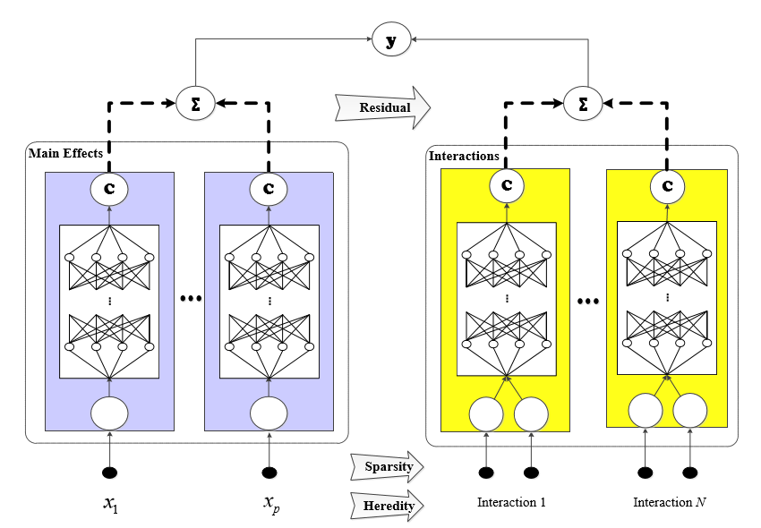
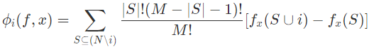
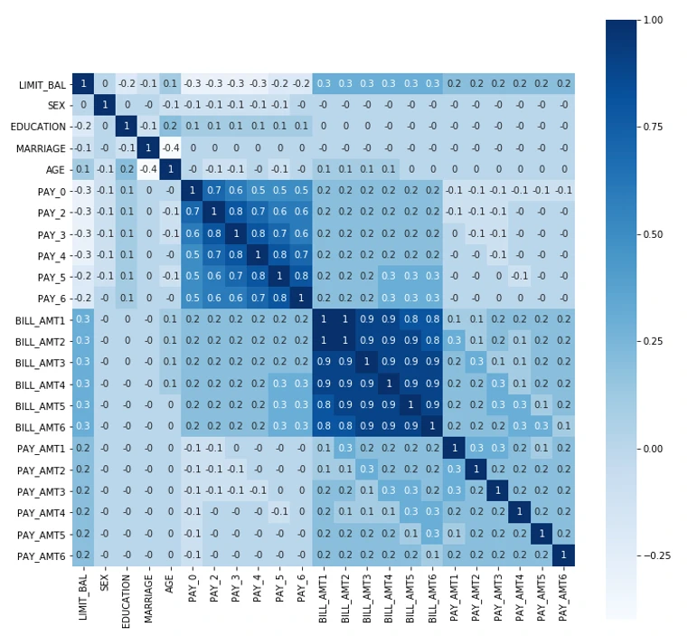

# 可解释性网络模型

## 综述1

[告别 AI 模型黑盒：可解释机器学习研究报告 作者：索信达控股](https://www.infoq.cn/article/k2UYsled2yEE0xUOaXQk)

### 1.可解释机器学习

可以分为两类：

1. 内在可解释机器学习
    - 对于可解释性高的模型，我们希望模型往纵轴方向走，即通过改良模型结构，在保证内在可解释属性的前提下，通过增强模型灵活表征能力，提高他们的精度，如我们在后续介绍的 GAMxNN、GAMINET、EBM 模型，都属于内在可解释机器学习模型
2. 事后解释方法
    - 对于预测精度较高的模型，我们希望使用事后解析的方法去提升他们的可解释性，让模型往横轴方向走，事后解析方法就是对类似黑盒的复杂机器学习算法，在模型训练完成后，通过事后解析方法来提升可解释性，利用事后辅助的归因解析及可视化工具来获得模型的可解释性，如 LIME、SHAP 等方法都属于事后解析方法。

  

### 2.可解释机器学习模型和方法

  

> 内在可解释机器学习

#### 2.1 GAMxNN模型

GAMxNN 模型全称为广义加性可解释神经网络模型（Explainable Neural Network based on Generalized Additive Model）[原文链接](papers/1806.01933.pdf)、[张爱军团队改进](papers/1901.03838.pdf)。
GAMxNN能提供整体和局部解释性，可以可视化呈现。数学上，其模型表示为：
$$ g(E(Y)) = \beta_0+f_1(x_1)+...+f_m(x_m) $$
其中$ f_i(x_i) $为**岭函数（任意光滑的函数）**， $ g(.) $为**关联函数**，$ \beta_0 $表示**截距项**。此为**广义加性模型**，相比单纯的线性模型引入非线性，增强表征能力。$ Y $为**待预测值**。
对应结构如下：
  
GAMxNN 模型最终能够输出模型的全局解释，包括特征重要性及得分趋势图、特征取值分布图；同时 GAMxNN 也能够输出局部解释图，显示出每一个样本在不同特征上的得分情况。

#### 2.2 GAMINET模型

[原文链接](papers/2003.07132.pdf)
在 GAMxNN 模型基础上，增加了特征交互项的探索。
考虑了三种可解释约束：

1. 稀疏性约束（Sparsity）：只保留最重要的特征与交互项，使得模型更简约
2. 遗传性约束（Heredity）：模型衍生出来的交互项是基于模型保留的特征，不会“无中生有”，使得模型结构性可解释
3. 边际清晰度约束（Marginal Clarity）：更易区分主效应的影响与交互效应的影响

其模型数学表达式为：
$$ g(E(Y))=\mu+\Sigma_{i\in S_1}h_i(x_i)+ \Sigma_{(i,j)\in S_2}f_{ij}(x_i,x_j)$$
其中，$ \mu $表示截距项，$ S_1 $表示主效应的集合，$ S_2 $表示交互效应的集合。
模型先拟合主效应，拟合完对现有残差拟合交互效应，直至训练结束。
GAMINET模型结构图如下：
  

#### 2.3 EBM模型

[原文链接](papers/10.1.1.433.8241.pdf)全称为 Explainable Boosting Machine，是由 Boosting Machine 改良而来，精度可与随机森林、提升树模型相媲美。
EBM 是一个可解释性高的加性模型，也会自动搜索特征的交互项，因此能直接从模型中反映出单个特征与交互特征对模型结果的影响。
与 GAMINET 模型的不同之处是，EBM 模型在抓取特征的函数关系时，用的是提升方法（boosting），而 GAMINET 用的是神经网络。
其数学表达式为：
$$ g(E(Y))=\beta_0+\Sigma_jf_j(x_j)+\Sigma_{(i\neq j)}f_{ij}(x_i,x_j) $$其中$ f_{j}(x_j) $表示基函数。$EBM 的每一个基函数由单个特征训练而成，交互项函数由双特征训练而成。与 GAMINET 类似，模型先拟合单一特征，找出最优的 fj (xj)fij(xi,xj) ，从中挑选出最好的 k 个交互项（k 由通过交叉验证得到）

- 对于回归问题，EBM 使用回归样条（Regression Splines）作为基函数，其表达式为$ y=\Sigma_{k=1}^d\beta_kb_k(x) $，使用正则化的最小二乘法来确定模型参数：$$ \beta = \argmin\limits_{\beta}||y-X\beta||+\lambda\Sigma_i\int[f''(x)]^2 $$$ \lambda $越大，拟合函数越光滑
- 对分类问题，EBM使用二叉树或集成二叉树作基函数。针对集成二叉树，以 Bagging 或 Backfitting 作为集成方法，对若干梯度提升树进行集成，从而得到基函数。

> 复杂模型的事后解析方法

#### 2.4 LIME

LIME 全称 Local Interpretable Model-Agnostic Explanations.[原文链接](papers/1602.04938.pdf)。LIME 在训练完模型后给出模型的解释，解释结果可以用于判断模型是否出错。如果出错，我们将结果反馈到模型当中，重新训练模型；如果无误，则将结果用于落地实施。

- Local: 基于想要解释的预测值及其附近的样本，构建局部的线性模型或其他代理模型；
- Interpretable: LIME 做出的解释易被人类理解。利用局部可解释的模型对黑盒模型的预测结果进行解释，构造局部样本特征和预测结果之间的关系；
- Model-Agnostic: LIME 解释的算法与模型无关，无论是用 Random Forest、SVM 还是 XGBoost 等各种复杂的模型，得到的预测结果都能使用 LIME 方法来解释；
- Explanations: LIME 是一种事后解析方法

LIME 的算法需要输入想要解释的预测样本和已经训练好的复杂模型，可处理不同类型的输入数据，如表格数据 (Tabular Data)、图像数据（Image Data）或文本数据 (Text Data)。步骤如下：

1. 预测样本附近随机采样
    - 对于连续型(continuous)特征，LIME 在预测样本点附近用一个标准正态分布 N(0,1)来产生指定个数的样本；
    - 而对于类别型(categorical)特征，则根据训练集的分布进行采样，当新生成样本的类别型特征与预测样本相同时，该类别型特征取值为 1，否则取值为 0；
    - 如，对于样本特征向量$ x=(x_1,x_2,...,x_p) $，其第i个样本为连续型样本，则生成的N个样本为$ \{z_k\}, z_k=(z_{k1},z_{k2},...,z_{kp}), k=1,2,...,N $，其中$ z_{ki}=a_{ki}*\sigma_i+x_i $，其中$ \sigma_i $为训练集中第i个特征的标准差，$ a_{ki} $为标准正态分布N(0,1)生成的随机数。
2. 对新生成的样本打标签
    - 将新生成的样本放入已经训练好的复杂模型中预测，得到对应的预测结果$ f(z_1),f(z_2),...,f(z_N) $
3. 计算新生成的样本与想要解释的预测点的距离并得到权重
    - 距离想要解释的预测点越近，认为这些样本能够更好的解释预测点，因此赋予更高的权重，权重公式为：$$ \pi_x(z)=exp(\frac{-D(x,z)^2}{\sigma^2}) $$其中，$ {D(x,z)} $为新生成的样本到待解释样本点的距离函数，$ \sigma $为超参数。
4. 筛选用来解释的特征，拟合线性模型
    - 从p个特征中选取p'个特征用以解释，选择方法有：forward selection、highest weights、lasso等
    - 对于这p'个特征，构造线性模型$ g(z')=\omega_0+\omega_1z_{(1)}+...+\omega_{p'}z_{(p')} $，其中$ z'=(z_{(1)},z_{(2)},...,z_{(p')}) $为从z中选取的p个特征的向量。学习$ \omega_g $所用的损失函数为：$$ l(f,h,\pi_x)=\Sigma_{k=1}^N\pi_x(z_k)(f(z_k)-g(z_k'))^2 $$如此，对于上面提到的权重π大的项，线性模型对其拟合的更好，即这些邻近项在拟合线性模型时会发挥更大的作用。
    - 最后得到$ \omega_g,z' $作为用来解释的特征线性组合。且该过程与模型的类型无关。
  
#### 2.5 SHAP

SHAP 全称是 SHapley Additive exPlanation，[原文链接](papers/NIPS-2017-a-unified-approach-to-interpreting-model-predictions-Paper.pdf)

- Shapley:代表对每个样本中的每一个特征变量，都计算出它的 Shapley Value。
- Additive: 代表对每一个样本而言，特征变量对应的 shapley value 是可加的。
- Explanation：代表对单个样本的解释，即每个特征变量是如何影响模型的预测值。

特征的重要性值在 SHAP 中称为 Shapley Value，是博弈论的概念。
和LIME类似，SHAP也有新的模型$ g $解释原始模型$ f $。满足$ g(x)=\phi_0+\Sigma_{i=1}^M\phi_ix_i=f(x) $的$ \phi_i $的解在g满足*局部保真性、缺失性、连续性*时有唯一解：
  
其中，i代表第i个特征变量，N是特征标量下标集合。

### 3.可解释机器学习应用案例

信用卡违约风险数据集->信用卡违约预测

#### 3.1 案例背景

- 明确案例背景，以及数据集基本信息：样本数量，特征变量数量；样本时空范围，样本描述对象和待预测指标（分类/回归）。

#### 3.2 数据集探索

- 明确特征内容，划分离散型和连续性变量。

> 数据集主要涉及用户的基本信息、还款状态、贷款情况、还款金额等特征。其中，性别、教育水平、婚姻情况、还款情况为离散型变量，剩余特征为连续型特征。

- 再对数据做简单的分析，查看各个特征的分布情况。包括：取值个数，平均值，标准差，最小值，25%分位数，中位数，75%分位数，最大值以及极值

>   

- 对于离散特征，通过卡方检验计算每个特征的p值，检验特征与响应变量的相关关系

> p 值小于 0.05，代表该特征与响应变量不独立，存在相关关系；反之，则不存在相关关系。由表 3.3 可以看出，除婚姻以外，其他离散特征的 p 值均小于 0.05，说明这些特征与响应变量存在相关关系。

- 对于连续特征，响应变量的两种取值 0 和 1，将其分为两组，对其做t检验

> 若 p 值小于 0.05，代表响应变量在不同取值下，该特征的分布有明显差异，即该特征与响应变量存在一定的相关性。由表 3.4 可以看出，除了 BILL_AMT6 之外，其他特征的 p 值都比较小的，说明这些特征与响应变量有一定的关系。

- 对特征进行相关性分析，计算皮尔森相关系数矩阵

>   

#### 3.3 数据预处理

- 缺失值处理
- 异常值处理
  - 舍弃
  - 归类

#### 3.4 特征工程

- 常用特征工程方法包括采样、单一特征归一化标准化处理、多特征降维、特征衍生和选择等等。

> 针对本案例中已完成预处理的数据集，首先对分类特征如性别（SEX）、学历（EDUCATION）等做***独热编码**处理。其次检查所有连续型特征的分布情况，绘制其概率分布函数。针对长尾分布的特征，如可透支金额、账单金额等特征，**取对数削弱长尾影响**。最后对连续特征做标准化处理，以减少特征值域对模型的影响。

### Reference

[1] Jie Chen, Wells Fargo.Deep insights into interpretability of machine learning algorithms and applications to risk management, Mar 27, 2019.

[2] Lael Brainard (2018). What are we learning about artificial intelligence in financial services? (https://www.federalreserve.gov/newsevents/speech/brainard20181113a.htm.)

[3] 《金融科技（FinTech）发展规划（2019-2021 年）》

[4] Finale Doshi-Velez and Been Kim(2017). Towards A Rigorous Science of Interpretable Machine Learning.

[5] Christoph Molnar. Interpretable Machine Learning[M]. February 28, 2020.

[6] Joel Vaughan and Agus Sudjianto and Erind Brahimi and Jie Chen and Vijayan N. Nair(2018). Explainable Neural Networks based on Additive Index Models

[7] Zebin Yang, Aijun Zhang, Agus Sudjianto(2019). Enhancing Explainability of Neural Networks through Architecture Constraints.

[8] Zebin Yang, Aijun Zhang, Agus Sudjianto(2020). GAMI-Net: An Explainable Neural Network based on Generalized Additive Models with Structured Interactions.

[9] Yin Lou,Rich Caruana,Johannes Gehrke(2012). Intelligible Models for Classification and Regression.

[10] Ribeiro, Marco Tulio, Sameer Singh, and Carlos Guestrin. “Why Should I Trust You?: Explaining the predictions of any classifier.” Proceedings of the 22nd ACM SIGKDD International Conference on Knowledge Discovery and Data Mining. ACM, 2016.

[11] Scott M. Lundberg, Su-in Lee. A Unified Approach to Interpreting Model Predictions, 2016.

[12] EY 安永(2019)，《中国上市银行 2019 年回顾及未来展望》

[13] R. Caruana, Y. Lou, J. Gehrke, P. Koch, M. Sturm, and N. Elhadad (2015). Intelligible Models for HealthCare: Predicting Pneumonia Risk and Hospital 30-day Readmission

[14] Scott M. Lundberg, Su-in Lee. From local explanations to global understanding with explainable AI for trees.2020.
